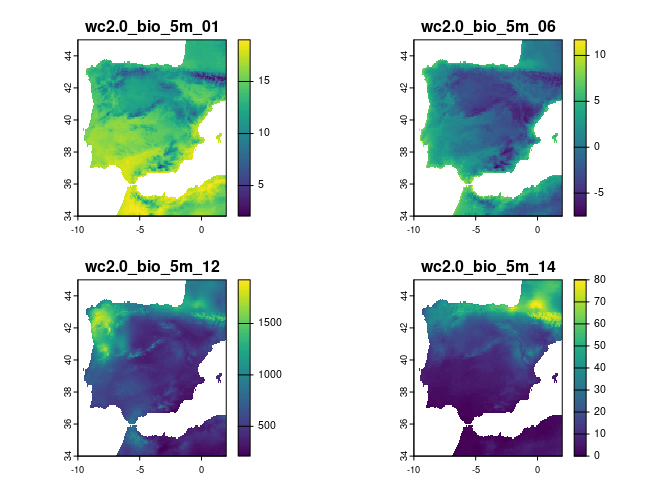
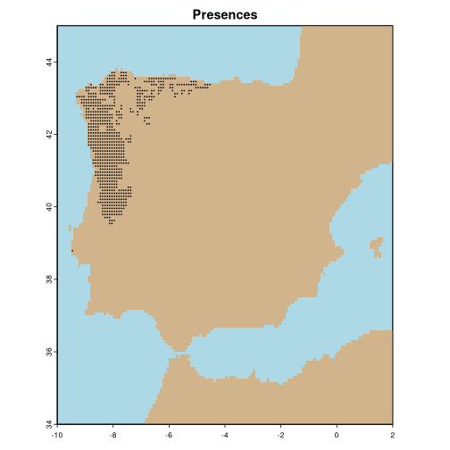
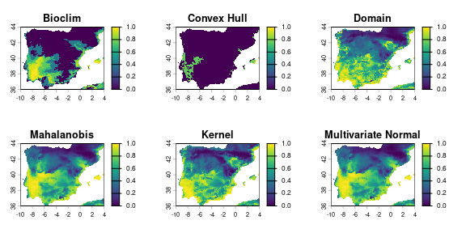

<!-- README.md is generated from README.Rmd. Please edit that file -->

# proniche: PResence-Only NICHE modelling

R package for computing niche models using a variety of **truly
presence-only methods** (i.e., methods that use only environmental info
from the presence sites, with no background or pseudo-absence data):

- Bioclim (rectangular environmental envelope)
- Convex hull (in environmental space)
- Domain
- Mahalanobis distance
- Kernel density estimate
- Multivariate normal distribution

## User guide

### (Install and) load package

``` r
# devtools::install_github("https://github.com/ptarroso/proniche")

library(proniche)
```

### Import some example data

``` r
tmp <- terra::rast(c("GIS/wc2.0_bio_5m_01.tif", "GIS/wc2.0_bio_5m_06.tif"))
prc <- terra::rast(c("GIS/wc2.0_bio_5m_12.tif", "GIS/wc2.0_bio_5m_14.tif"))
vars <- c(tmp, prc)
terra::plot(vars)
```



``` r

chilus <- read.csv("GIS/chilus.csv", sep=";")
vals <- terra::extract(vars, chilus, ID=FALSE)
terra::plot(vars[[1]] * 0, col = "grey", legend = FALSE, main = "Presences")
points(chilus, pch = 20, cex = 0.2)
```



### Compute model predictions

``` r
bc <- promodel(vals, vars, method = "bioclim")
ch <- promodel(vals, vars, method = "convexhull")
dm <- promodel(vals, vars, method = "domain")
mm <- promodel(vals, vars, method = "mahalanobis")
km <- promodel(vals, vars, method = "kernel")
mv <- promodel(vals, vars, method = "mvnormal")

par(mfrow = c(2, 3))
terra::plot(bc[[1]], main="Bioclim")
terra::plot(ch[[1]], main="Convex Hull")
terra::plot(dm[[1]], main="Domain")
terra::plot(mm[[1]], main="Mahalanobis")
terra::plot(km[[1]], main="Kernel")
terra::plot(mv[[1]], main="Multivariate Normal")
```


### Reclassify predictions into comparable scale

``` r
bc_rcl <- quantReclass(bc[[1]])
ch_rcl <- quantReclass(ch[[1]])
dm_rcl <- quantReclass(dm[[1]])
mm_rcl <- quantReclass(mm[[1]])
km_rcl <- quantReclass(km[[1]])
mv_rcl <- quantReclass(mv[[1]])

par(mfrow = c(2, 3))
terra::plot(bc_rcl, type = "continuous", main="Bioclim")
terra::plot(ch_rcl, type = "continuous", main="Convex Hull")
terra::plot(dm_rcl, type = "continuous", main="Domain")
terra::plot(mm_rcl, type = "continuous", main="Mahalanobis")
terra::plot(km_rcl, type = "continuous", main="Kernel")
terra::plot(mv_rcl, type = "continuous", main="Multivariate Normal")
```



## TO DO

- ~~Add multivariate normal distribution~~

- ~~Maybe add resampling to Mahalanobis (needs to estimate covariance)~~

- ~~Create an R package~~

- ~~Add documentation and references to original model publications~~

- ~~Maybe some accessory functions to clean data set? (Remove
  duplicates, NAs, etc)~~

- ~~Instead of receiving coordinates as input, perhaps modelling
  functions should get already the environmental values at presences?~~

- Function to plot models representation in environmental space?

- ~~Implement for data frames (not just SpatRasters)~~

- ~~Add function to reclassify predictions into comparable scale~~
