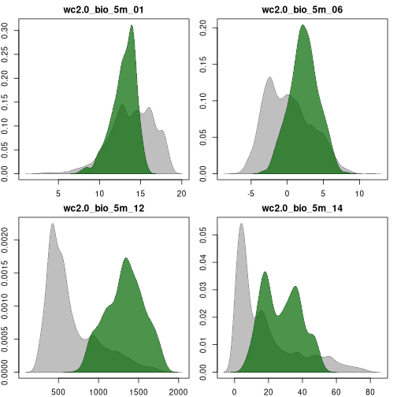
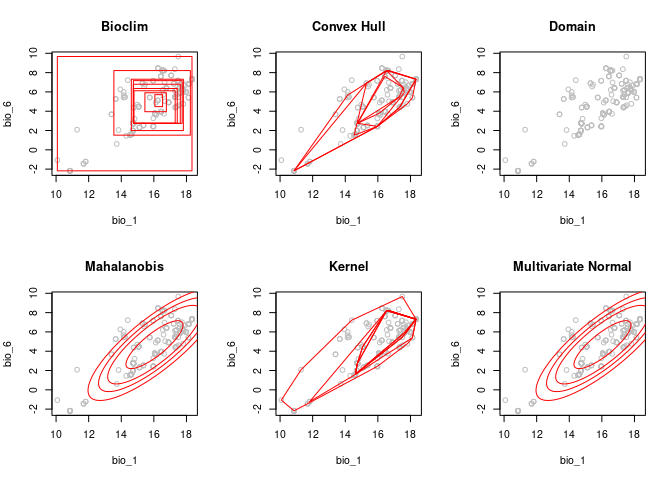
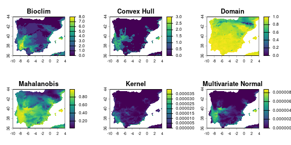
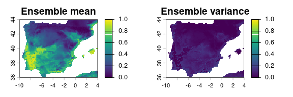

<!-- README.md is generated from README.Rmd. Please edit that file -->

# proniche: PResence-Only NICHE modelling

R package for computing niche models using a variety of **truly
presence-only methods** (i.e., methods that use only environmental info
from the presence sites, with no background or pseudo-absence data):

- Bioclim (rectangular environmental envelope)
- Convex hull (in environmental space)
- Domain
- Mahalanobis distance
- Kernel density estimate
- Multivariate normal distribution

## User guide

### (Install and) load packages

``` r
# devtools::install_github("https://github.com/ptarroso/proniche")
# or:
# remotes::install_github("https://github.com/ptarroso/proniche")

library(proniche)
library(terra)
library(geodata)
```

### Import some example data within a region

``` r
# import, select and crop a few bioclimatic variables:
vars <- geodata::worldclim_global(var = "bio", res = 5, path = "outputs")
names(vars) <- sub("wc2.1_5m_", "", names(vars))
vars <- vars[[c("bio_1", "bio_6", "bio_12", "bio_14")]]
vars <- terra::crop(vars, terra::ext(-10, 4, 36, 44))
terra::plot(vars)
```


``` r

# import species occurrence records in this region:
occs <- geodata::sp_occurrence(genus = "Tuta", 
                               species = "absoluta", 
                               ext = vars)
#> Loading required namespace: jsonlite
#> 335 records found
#> 0-300-335
#> 335 records downloaded
occs <- occs[ , c("lon", "lat")]

# map the occurrence records:
terra::plot(vars[[1]] * 0, col = "tan", background = "lightblue",
            legend = FALSE, main = "Presences")
points(occs, pch = 20, cex = 0.2)
```


### Plot frequency distributions

``` r
vals <- terra::extract(vars, occs, ID = FALSE)

par(mfrow = c(2, 2), mar = c(2, 2, 2, 1))
proniche::freqPlot(vals, vars)
```



### Fit true presence-only models

``` r
bc_fit <- proniche::promodel(vals, method = "bioclim")
ch_fit <- proniche::promodel(vals, method = "convexhull")
dm_fit <- proniche::promodel(vals, method = "domain")
mm_fit <- proniche::promodel(vals, method = "mahalanobis")
km_fit <- proniche::promodel(vals, method = "kernel")
mv_fit <- proniche::promodel(vals, method = "mvnormal")
```

### Plot models in environmental space

``` r
par(mfrow = c(2, 3))
plot(bc_fit, main = "Bioclim")
plot(ch_fit, main = "Convex Hull")
plot(dm_fit, main = "Domain")
plot(mm_fit, main = "Mahalanobis")
plot(km_fit, main = "Kernel")
plot(mv_fit, main = "Multivariate Normal")
```



### Map model predictions

``` r
bc <- predict(bc_fit, vars)
ch <- predict(ch_fit, vars)
dm <- predict(dm_fit, vars)
mm <- predict(mm_fit, vars)
km <- predict(km_fit, vars)
mv <- predict(mv_fit, vars)

par(mfrow = c(2, 3))
terra::plot(bc, type = "continuous", main = "Bioclim")
terra::plot(ch, type = "continuous", main = "Convex Hull")
terra::plot(dm, type = "continuous", main = "Domain")
terra::plot(mm, type = "continuous", main = "Mahalanobis")
terra::plot(km, type = "continuous", main = "Kernel")
terra::plot(mv, type = "continuous", main = "Multivariate Normal")
```



### Reclassify predictions into a comparable scale

``` r
bc_rcl <- proniche::quantReclass(bc[[1]])
ch_rcl <- proniche::quantReclass(ch[[1]])
dm_rcl <- proniche::quantReclass(dm[[1]])
mm_rcl <- proniche::quantReclass(mm[[1]])
km_rcl <- proniche::quantReclass(km[[1]])
mv_rcl <- proniche::quantReclass(mv[[1]])

par(mfrow = c(2, 3))
terra::plot(bc_rcl, range = c(0, 1), type = "continuous", main = "Bioclim")
terra::plot(ch_rcl, range = c(0, 1), type = "continuous", main = "Convex Hull")
terra::plot(dm_rcl, range = c(0, 1), type = "continuous", main = "Domain")
terra::plot(mm_rcl, range = c(0, 1), type = "continuous", main = "Mahalanobis")
terra::plot(km_rcl, range = c(0, 1), type = "continuous", main = "Kernel")
terra::plot(mv_rcl, range = c(0, 1), type = "continuous", main = "Multivariate Normal")
```


### Ensemble predictions

``` r
preds <- c(bc_rcl, ch_rcl, dm_rcl, mm_rcl, km_rcl, mv_rcl)
ens_mean <- terra::app(preds, "mean")
ens_var <- terra::app(preds, "var")
par(mfrow = c(1, 2))
terra::plot(ens_mean, range = c(0, 1), main = "Ensemble mean")
terra::plot(ens_var, range = c(0, 1), main = "Ensemble variance")
```


